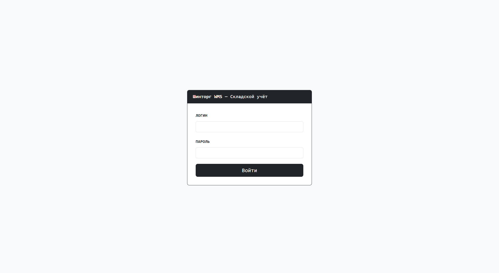
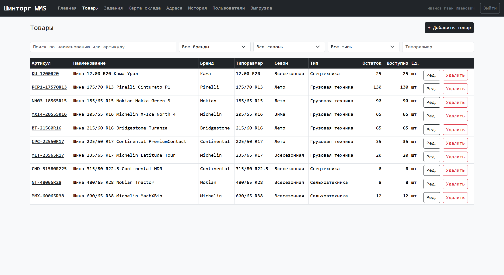
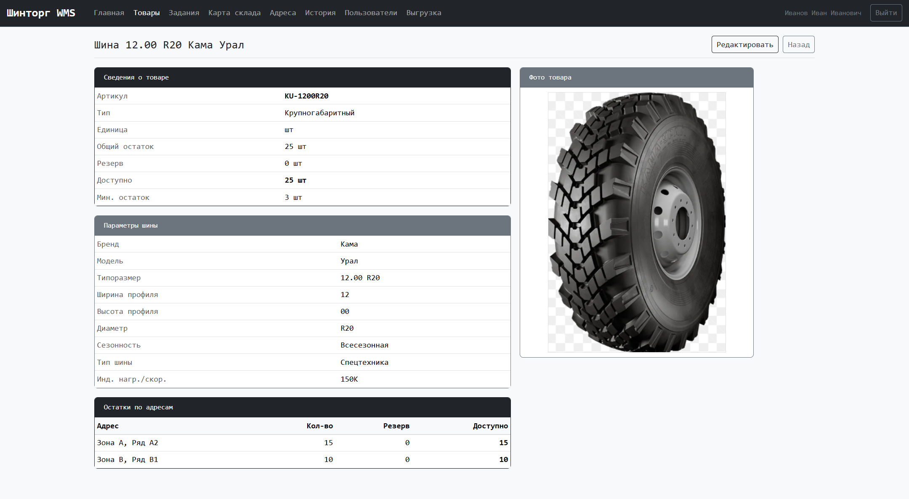
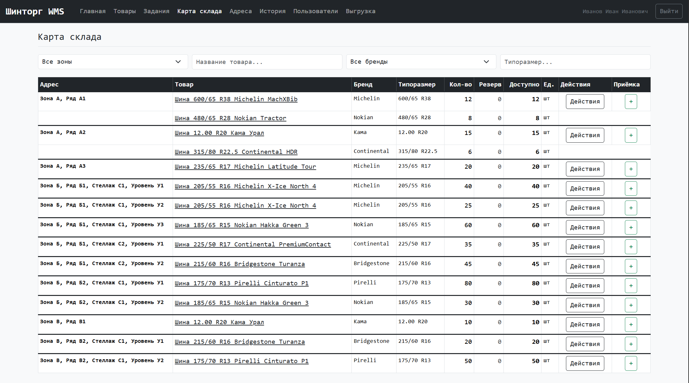
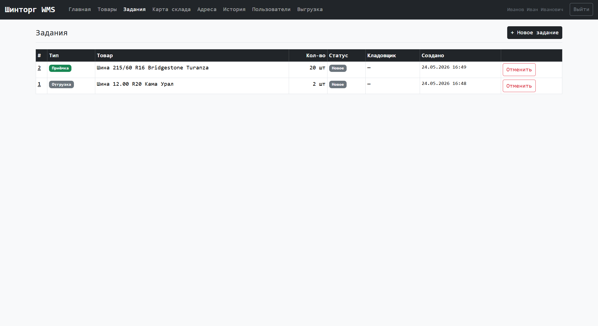
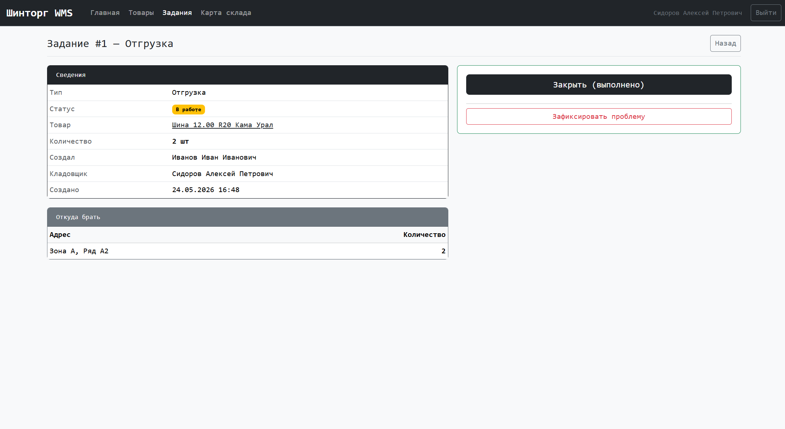
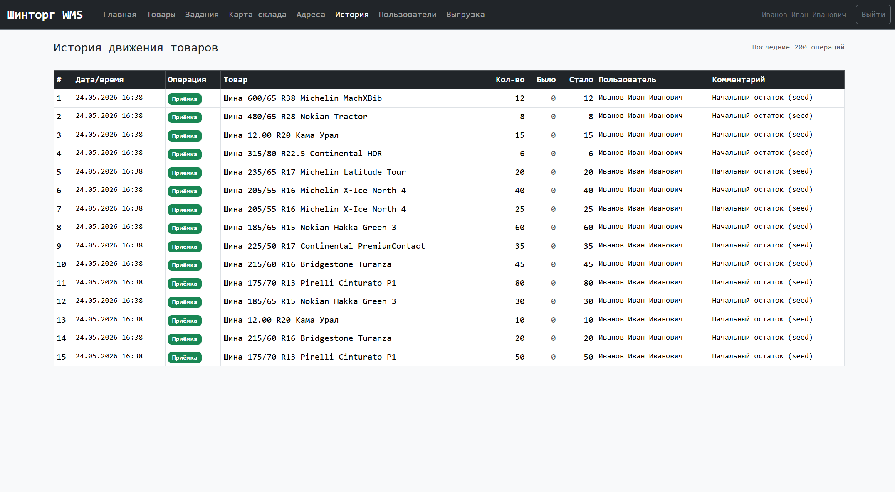
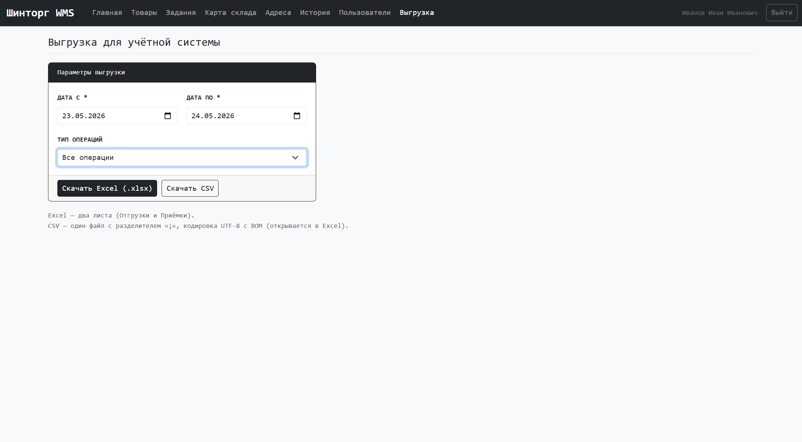
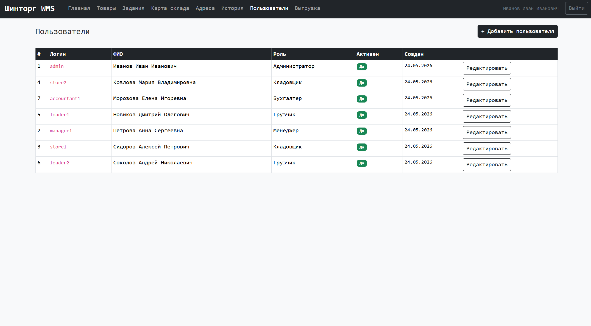
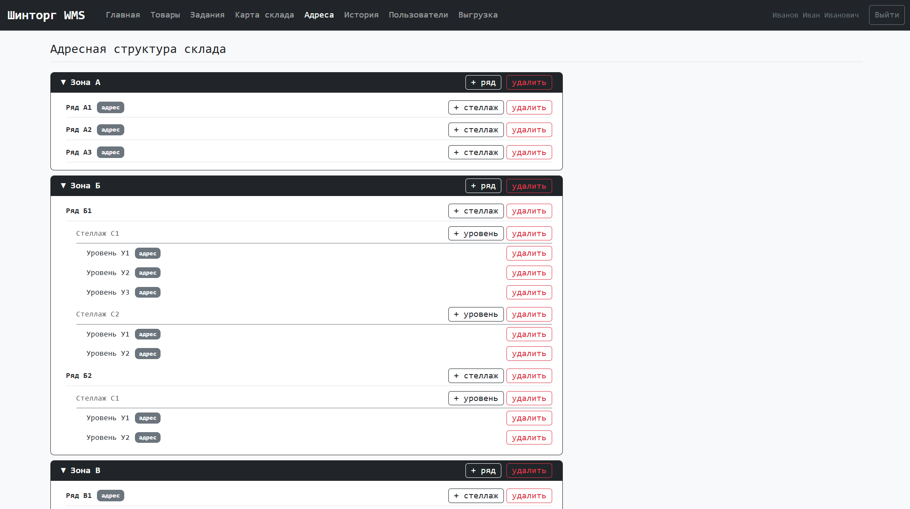

# Шинторг WMS — Складская информационная система

Веб-приложение для управления складом шин. Разработано для ООО «Шинторг».

---
## Скриншоты

Экран входа

Список товаров

Карточка товара

Карта склада

Задания

Карточка задания

История движения

Экспорт

Пользователи

Адресная структура

---

---

## Структура проекта

```
shintorg_v2/
├── main.py                  # Точка входа FastAPI
├── database.py              # Подключение к БД
├── config.py                # Конфигурация из переменных окружения
├── create_admin.py          # Скрипт создания первого администратора
├── seed.py                  # Скрипт заполнения тестовыми данными
├── requirements.txt
├── Dockerfile
├── docker-compose.yml
│
├── models/                  # SQLAlchemy модели
│   ├── user.py
│   ├── address.py           # Zone, Row, Shelf, Level, StorageAddress
│   ├── product.py           # Product, StockLocation
│   ├── task.py              # Task, TaskLine
│   └── stock_operation.py
│
├── routers/                 # FastAPI роутеры
│   ├── auth.py
│   ├── dashboard.py
│   ├── products.py
│   ├── addresses.py
│   ├── tasks.py
│   ├── stock.py
│   ├── warehouse.py         # Карта склада
│   ├── export.py
│   └── users.py
│
├── services/                # Бизнес-логика
│   ├── auth_service.py
│   ├── stock_service.py     # Приёмка, списание, перемещение
│   ├── task_service.py      # Создание, планирование, закрытие заданий
│   └── export_service.py
│
├── templates/               # Jinja2 шаблоны
│   ├── base.html
│   ├── login.html
│   ├── dashboard/
│   ├── products/
│   ├── tasks/
│   ├── addresses/
│   ├── warehouse/
│   ├── stock/
│   ├── export/
│   └── users/
│
└── static/
    ├── css/custom.css
    ├── js/main.js
    └── vendor/bootstrap/    # Bootstrap 5.3 (локально)
```

## Стек технологий

- **Backend:** Python 3.11, FastAPI, SQLAlchemy 2.0
- **База данных:** PostgreSQL 16
- **Шаблоны:** Jinja2
- **Frontend:** Bootstrap 5.3 (встроен локально, без CDN)
- **Развёртывание:** Docker, Docker Compose

---

## Быстрый старт

### 1. Требования

- Docker Desktop (Windows/Mac) или Docker + Docker Compose (Linux)

### 2. Запуск

```bash
# Клонировать / распаковать проект
cd shintorg_v2

# Обязательно: поменяйте SECRET_KEY в docker-compose.yml
# SECRET_KEY: ваш-секретный-ключ-не-менее-32-символов

docker compose up -d --build
```

Приложение будет доступно по адресу: **http://localhost:8000**

### 3. Создание администратора

```bash
docker compose exec app python create_admin.py
```

### 4. Заполнение тестовыми данными (опционально)

```bash
docker compose exec app python seed.py
```

Создаёт 7 пользователей всех ролей, адресную структуру склада, 10 товаров и остатки.  
**Внимание:** скрипт очищает все таблицы перед заполнением.

---

## Управление

```bash
# Остановить
docker compose down

# Перезапустить приложение (после изменения файлов)
docker compose restart app

# Пересобрать (после изменения requirements.txt или Dockerfile)
docker compose up -d --build

# Посмотреть логи
docker compose logs -f app

# Сбросить базу данных (осторожно — удаляет все данные!)
docker compose down -v
```

---

## Резервное копирование

```bash
# Создать бэкап базы данных
docker compose exec db pg_dump -U shintorg shintorg_wms > backup_$(date +%Y%m%d_%H%M).sql

# Восстановить из бэкапа
docker compose exec -T db psql -U shintorg shintorg_wms < backup_20240101_1200.sql
```

---

## Роли пользователей
У всех пароль 12345678

| Роль | Логин (пример) | Возможности |
|---|---|---|
| **Администратор** | admin | Полный доступ ко всем функциям |
| **Менеджер** | manager1 | Создание заданий на отгрузку и приёмку, просмотр всего |
| **Кладовщик** | store1 | Выполнение заданий, перемещение товаров, приёмка/списание на карте склада |
| **Грузчик** | loader1 | Просмотр активных заданий |
| **Бухгалтер** | accountant1 | Просмотр остатков, истории, выгрузка в Excel/CSV |

---

## Функциональность

### Товары
- Карточка товара с параметрами шины: бренд, модель, типоразмер, ширина/высота профиля, диаметр, сезонность, тип (грузовая/сельхоз/спецтехника), индекс нагрузки/скорости
- Остатки хранятся по адресам хранения (не общим числом)
- Фильтрация по бренду, типоразмеру, сезонности, типу шины
- Фото товара
- Минимальный остаток — при достижении выделяется в таблице и на дашборде

### Адресная структура склада
- Иерархическое дерево: Зона → Ряд → Стеллаж → Уровень
- Адресом хранения является: ряд без стеллажей (Зона+Ряд) или уровень (Зона+Ряд+Стеллаж+Уровень)
- Добавление элементов inline прямо в дереве
- При создании стеллажа обязательно нужно добавить хотя бы один уровень
- Нельзя удалить адрес на котором есть товар

### Задания
Три типа заданий:

| Тип | Кто создаёт | Кто выполняет |
|---|---|---|
| Отгрузка | Админ, Менеджер | Кладовщик планирует (откуда взять), Грузчик выполняет |
| Приёмка | Админ, Менеджер | Кладовщик планирует (куда поставить), Грузчик выполняет |
| Перемещение | Кладовщик, Админ (с карты склада) | Кладовщик планирует (откуда), Грузчик выполняет |

Статусы задания: `Новое → Планирование → В работе → Выполнено / Проблема / Отменено`

### Карта склада
- Таблица всех адресов включая пустые
- Фильтры: по зоне, названию товара, бренду, типоразмеру
- Кнопка **Действия** (кладовщик/админ) — открывает форму для: создания задания на перемещение, прямого перемещения, списания
- Кнопка **Приёмка** (только админ) — прямая приёмка товара на адрес без создания задания

### Движение товара
- **Приёмка** — через задание или напрямую на карте склада
- **Отгрузка** — только через задание
- **Перемещение** — через задание или напрямую на карте склада
- **Списание** — через карту склада

### История движения
Все операции фиксируются: приёмка, отгрузка, списание, перемещение (откуда/куда).

### Выгрузка для бухгалтерии
- Выгрузка за произвольный период
- Форматы: Excel (.xlsx, два листа — Отгрузки и Приёмки) и CSV (с BOM для корректного открытия в Excel)
- Фильтр по типу операций
- 
## Переменные окружения

| Переменная | По умолчанию | Описание |
|---|---|---|
| `DATABASE_URL` | `postgresql://shintorg:shintorg@db:5432/shintorg_wms` | Строка подключения к БД |
| `SECRET_KEY` | — | Секретный ключ для JWT (обязательно менять!) |
| `ALGORITHM` | `HS256` | Алгоритм подписи JWT |
| `ACCESS_TOKEN_EXPIRE_MINUTES` | `480` | Время жизни сессии (8 часов) |
| `UPLOAD_DIR` | `/app/uploads` | Директория для загрузки фото |